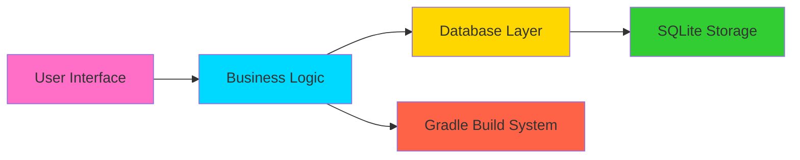

<div align="center">

<!-- Animated Typing Header with Cosmic Effect -->


<!-- Badges -->


</div>

---


## 🌟 **About This Project**

The **Student Management System** is a comprehensive Android application designed to streamline the management of student records with modern UI patterns and efficient CRUD operations. Built with Java and Gradle, this project demonstrates professional Android development practices including database management, responsive UI design, and modular architecture.

<div align="center">

### 💻 **Tech Stack**


</div>

---


## 🎯 **Key Features**

<table>
<tr>
<td width="50%">

### 📋 **CRUD Operations**
- **Create**: Add new student records with validation
- **Read**: View and search through student database
- **Update**: Edit existing student information
- **Delete**: Remove student records with confirmation

</td>
<td width="50%">

### 🎨 **Modern UI/UX**
- Material Design components
- Smooth animations and transitions
- Responsive layouts for all screen sizes
- Intuitive navigation patterns

</td>
</tr>
<tr>
<td width="50%">

### 💾 **Database Management**
- SQLite local database
- Efficient query optimization
- Data persistence
- Backup and restore capabilities

</td>
<td width="50%">

### 🔧 **Build System**
- Gradle 7.1.2 build automation
- Dependency management
- Multi-module support
- Debug and release variants

</td>
</tr>
</table>

---


## 📁 **Project Structure & Configuration Files**

### 🏗️ **Core Build Files**

#### `build.gradle`
```gradle
// Root-level build configuration
```
The main Gradle build script that defines:
- **Project-level dependencies** and repositories
- **Gradle version**: 7.1.2
- **Android Gradle Plugin** configuration
- **Build script classpath** dependencies
- Repository sources (Google, Maven Central, JCenter)

**Key Functions:**
- Manages all subproject configurations
- Defines common build parameters
- Handles plugin versions and dependencies

---

#### `settings.gradle`
```gradle
// Project settings and module inclusion
```
Defines the project structure and settings:
- **Root project name**: Student-Management
- **Module inclusions**: Specifies which modules to include in the build
- **Plugin management**: Configures plugin repositories

**Key Functions:**
- Establishes project hierarchy
- Enables/disables specific modules
- Configures Gradle settings

---

#### `gradlew` & `gradlew.bat`
```bash
# Gradle Wrapper Scripts
```
**`gradlew`** (Unix/Linux/Mac):
- Shell script for Unix-based systems
- Ensures consistent Gradle version across environments
- Automatically downloads specified Gradle version
- Enables CI/CD integration

**`gradlew.bat`** (Windows):
- Batch script for Windows systems
- Same functionality as gradlew for Windows
- Handles path differences in Windows environment

**Benefits:**
- ✅ No need to install Gradle manually
- ✅ Version consistency across team
- ✅ Reproducible builds
- ✅ CI/CD pipeline compatibility

---

#### `local.properties`
```properties
# Local SDK path configuration
```
Contains machine-specific configurations:
- **SDK Location**: Path to Android SDK on local machine
- **NDK Path**: Native development kit path (if used)
- **Environment Variables**: Local development settings

**⚠️ Important:**
- This file is **NOT** version controlled (in .gitignore)
- Each developer has their own local.properties
- Contains absolute paths specific to developer's machine

---

#### `import-summary.txt`
```text
# Project import logs and warnings
```
Auto-generated file that logs:
- **Import Process Details**: When project was imported
- **Warnings**: Any issues during import
- **Gradle Sync Results**: Build configuration results
- **Module Information**: Detected modules and their status

**Usage:**
- Troubleshooting import issues
- Understanding project structure changes
- Debugging build configuration problems

---


## 🚀 **Getting Started**

### Prerequisites

```bash
☑️ Android Studio Arctic Fox or later
☑️ JDK 11 or higher
☑️ Android SDK 21+ (Lollipop and above)
☑️ Gradle 7.1.2 (handled by wrapper)
```

### Installation Steps

1️⃣ **Clone the Repository**
```bash
git clone https://github.com/SolvyrEryx/Student-Management.git
cd Student-Management
```

2️⃣ **Open in Android Studio**
- Launch Android Studio
- Select "Open an Existing Project"
- Navigate to the cloned directory
- Wait for Gradle sync to complete

3️⃣ **Build the Project**
```bash
# Using Gradle Wrapper (recommended)
./gradlew build          # Unix/Linux/Mac
gradlew.bat build        # Windows

# Or use Android Studio's Build menu
```

4️⃣ **Run the Application**
- Connect an Android device or start an emulator
- Click the "Run" button in Android Studio
- Or use command line:
```bash
./gradlew installDebug
```

---


## 🔨 **Gradle Build Commands**

| Command | Description |
|---------|-------------|
| `./gradlew build` | Compile and build the entire project |
| `./gradlew clean` | Clean build artifacts |
| `./gradlew assembleDebug` | Build debug APK |
| `./gradlew assembleRelease` | Build release APK |
| `./gradlew installDebug` | Install debug build on connected device |
| `./gradlew test` | Run unit tests |
| `./gradlew lint` | Run Android lint checks |
| `./gradlew dependencies` | Display project dependencies |

---


## 🎨 **Project Highlights**

<div align="center">



</div>

### Architecture Components:
- **UI Layer**: Activities, Fragments, Adapters
- **Business Logic**: Managers, Utilities, Validators
- **Data Layer**: Database Helper, DAOs, Models
- **Build System**: Gradle configuration, dependencies

---


## 🤝 **Contributing**

Contributions are welcome! Please follow these guidelines:

1. **Fork** the repository
2. **Create** a feature branch (`git checkout -b feature/AmazingFeature`)
3. **Commit** your changes (`git commit -m 'Add some AmazingFeature'`)
4. **Push** to the branch (`git push origin feature/AmazingFeature`)
5. **Open** a Pull Request

### Contribution Guidelines:
- ✅ Follow existing code style and conventions
- ✅ Write clear, descriptive commit messages
- ✅ Add comments for complex logic
- ✅ Test your changes thoroughly
- ✅ Update documentation as needed

---


## 📋 **Platform & Requirements**

| Component | Requirement |
|-----------|-------------|
| **Platform** | Android 5.0 (API 21) and above |
| **Language** | Java |
| **Build Tool** | Gradle 7.1.2 |
| **IDE** | Android Studio (latest stable) |
| **Database** | SQLite |
| **Min SDK** | 21 |
| **Target SDK** | 33+ |

---


## 📝 **License**

This project is licensed under the MIT License - see the [LICENSE](LICENSE) file for details.

---


## 👨‍💻 **Author**

<div align="center">

### **SolvyrEryx**

[](https://github.com/SolvyrEryx)
[](https://github.com/SolvyrEryx)

*Passionate Android Developer | Building Innovative Solutions*

</div>

---


## 📞 **Connect & Support**

<div align="center">

### ⭐ If you find this project useful, please consider giving it a star!


</div>

---

<div align="center">

<!-- Animated Snake -->


### 🎓 **Built with ❤️ by SolvyrEryx**


**© 2024 SolvyrEryx | Student Management System**

</div>
